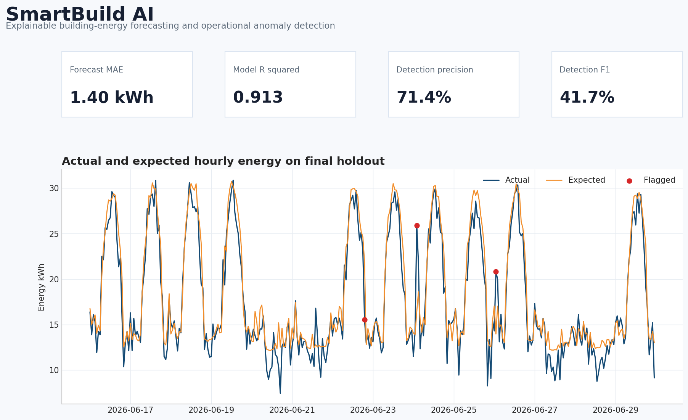
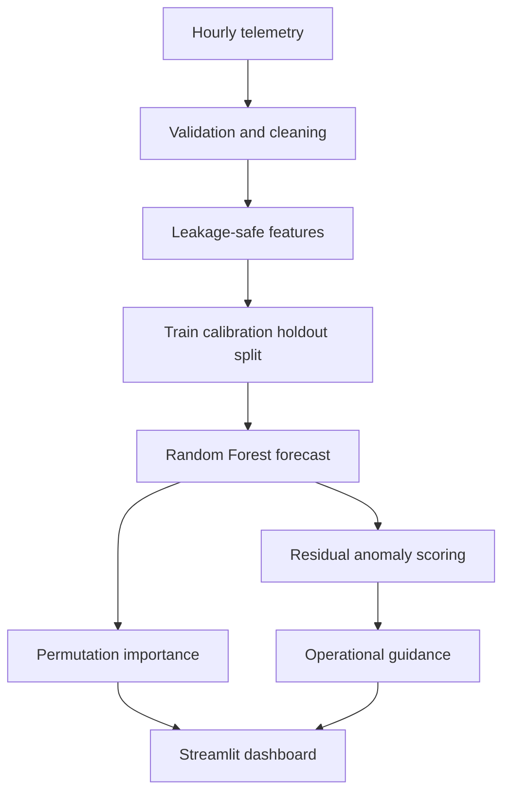

# SmartBuild AI

https://github.com/YOUR-USERNAME/smartbuild-ai.git


[](https://www.python.org/)
[](#quality-checks)
[](LICENSE)

**Explainable building-energy forecasting and operational anomaly detection**

SmartBuild AI is a complete portfolio application for commercial-building energy analysis. It forecasts
expected hourly electricity demand, detects unusual residual patterns, reports transparent holdout metrics,
and presents the results in an interactive Streamlit dashboard.



## Why this project matters

Facilities teams need more than a prediction. They need to know when observed consumption departs from an
expected operating pattern, how strong the signal is, and what to inspect next. SmartBuild AI combines
forecasting, anomaly screening, model interpretation, and cautious operational guidance in one reproducible
workflow.

## Demonstration results

The checked-in release uses a strict chronological 70/10/20 design: model training, anomaly-threshold
calibration, and untouched final holdout evaluation. Observations are never randomly shuffled.

| Holdout metric | Result |
|---|---:|
| Mean absolute error | 1.397 kWh |
| Root mean squared error | 1.837 kWh |
| R squared | 0.913 |
| MAE improvement over mean baseline | 87.5% |
| Anomaly precision | 71.4% |
| Anomaly recall | 29.4% |
| Anomaly F1 | 41.7% |

The results apply only to the deterministic synthetic demonstration building. They establish that the
software pipeline works under controlled conditions; they do not establish generalization to an unseen real
facility.

## Capabilities

- Leakage-controlled hourly energy forecasting with Random Forest regression
- Chronological training, threshold calibration, and untouched holdout testing
- Residual anomaly scoring with precision, recall, and F1 against injected labels
- Baseline comparison and permutation-importance interpretation
- Actual-versus-predicted charts and subsystem energy profiles
- Cautious rule-based operational explanations
- Temperature and occupancy what-if exploration
- Compatible CSV upload with schema validation
- Reproducible synthetic telemetry and inspectable holdout exports
- Automated tests, linting, and continuous integration

## Architecture



## Run locally

Python 3.11 or newer is recommended.

```bash
git clone https://github.com/YOUR-USERNAME/smartbuild-ai.git
cd smartbuild-ai
python -m venv .venv
source .venv/bin/activate
pip install -r requirements.txt
PYTHONPATH=src python scripts/generate_demo_data.py
PYTHONPATH=src python scripts/train_model.py
PYTHONPATH=src python scripts/export_holdout_predictions.py
PYTHONPATH=src streamlit run app.py
```

Windows PowerShell activation:

```powershell
.venv\Scripts\Activate.ps1
```

## Input schema

Required hourly columns:

| Column | Meaning |
|---|---|
| `timestamp` | Observation date and hour |
| `outdoor_temp_c` | Outdoor temperature in degrees Celsius |
| `humidity_pct` | Relative humidity percentage |
| `occupancy` | Estimated occupant count |
| `total_energy_kwh` | Total hourly electricity consumption |

Optional subsystem columns - `hvac_kwh`, `lighting_kwh`, `plug_load_kwh`, and
`critical_load_kwh` - enable the subsystem visualization. An optional `injected_anomaly` label enables
event-detection metrics.

## Evaluation design

1. The first 70% of usable observations trains the Random Forest.
2. The next 10% calibrates the residual threshold. When known synthetic labels exist, the threshold is
   selected to maximize calibration F1. Unlabelled uploads use a 97.5th-percentile calibration threshold.
3. The final 20% remains untouched until forecasting and anomaly evaluation.
4. Historical energy features are shifted before calculation, preventing the current target from appearing
   in its own predictors.

See [the model card](docs/MODEL_CARD.md), [the data card](docs/DATA_CARD.md), and the
[technical explanation report](docs/SmartBuild_AI_Technical_Explanation.pdf) for full details.

## Repository structure

```text
smartbuild-ai/
├── .github/workflows/quality.yml
├── .streamlit/config.toml
├── app.py
├── assets/dashboard_preview.png
├── data/building_energy.csv
├── docs/
│   ├── DATA_CARD.md
│   ├── MODEL_CARD.md
│   ├── SmartBuild_AI_Technical_Explanation.docx
│   └── SmartBuild_AI_Technical_Explanation.pdf
├── outputs/
│   ├── holdout_metrics.json
│   └── holdout_predictions.csv
├── scripts/
├── src/smartbuild/
└── tests/
```

## Quality checks

```bash
pip install -r requirements-dev.txt
PYTHONPATH=src pytest
PYTHONPATH=src ruff check .
PYTHONPATH=src ruff format --check .
```

## Responsible use and limitations

- Synthetic-data performance is not evidence of real-building performance.
- Residual anomalies are screening signals, not confirmed equipment diagnoses.
- Recall is deliberately reported alongside precision; the current detector misses some injected events.
- The what-if tool is a model scenario, not a physical building-energy simulation.
- Production deployment requires sensor-quality checks, drift monitoring, retraining controls, access
  controls, and validation with facility professionals.

## Roadmap

- Evaluate on a properly licensed real-world building-energy dataset.
- Add rolling-origin time-series cross-validation.
- Add local explanations only after selecting and validating an appropriate method.
- Deploy a public demonstration dashboard.

## Author

**Mahmoud Faraj**  
PhD in Electrical and Computer Engineering, University of Waterloo  
Applied AI, data science, engineering education, and smart-building systems

## License

This project is released under the [MIT License](LICENSE).
